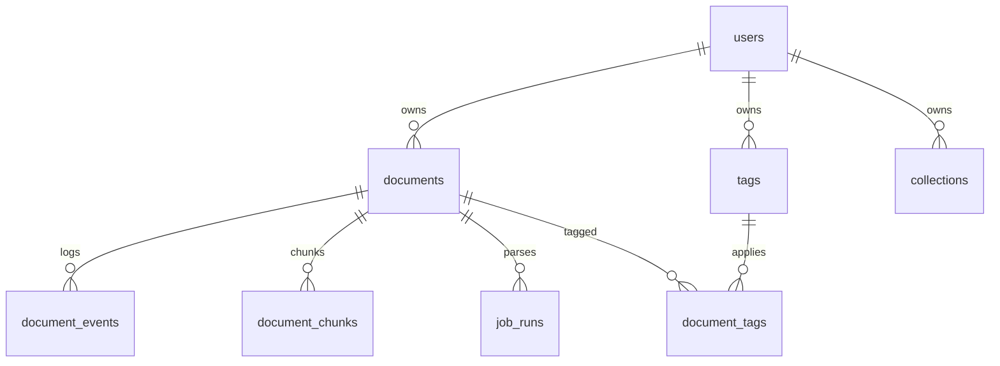

# Second Brain Knowledge Base

个人第二大脑 / 个人知识库系统。当前版本聚焦第三周考核：注册登录、JWT 鉴权、文档上传、真实文件类型校验、解析状态流转、标签管理、搜索筛选、批量操作、日志追踪、统计仪表盘和文件异常处理。

## 技术栈

- Backend: FastAPI, SQLAlchemy, Alembic, SQLite, Redis queue
- Auth: JWT, passlib bcrypt
- File parsing: PyMuPDF / pypdf, Markdown/TXT parser, chardet
- Frontend: React, Vite, TypeScript, React Query, Tailwind CSS
- Runtime: Docker Compose

## 本地启动

```bash
docker compose up --build
```

- 后端: http://localhost:8000
- 前端: http://localhost:3000

## 后端启动

```bash
docker compose up api redis
```

运行迁移：

```bash
docker compose run --rm api alembic upgrade head
```

## 前端启动

```bash
docker compose up frontend
```

## 环境变量

复制 `.env.example` 为 `.env` 后调整：

- `DATABASE_URL`: 数据库地址
- `JWT_SECRET_KEY`: JWT 签名密钥
- `JWT_ALGORITHM`: 默认 `HS256`
- `ACCESS_TOKEN_EXPIRE_MINUTES`: token 有效期
- `MAX_UPLOAD_SIZE`: 后端上传大小限制，未配置时默认 10 MB
- `UPLOAD_DIR`: 文件安全存储目录

## 数据库表

- `users`: 用户账号与 `hashed_password`
- `documents`: 文档元数据、解析文本、状态、失败原因、文件路径
- `document_events`: 文档生命周期日志
- `tags`: 用户私有标签
- `document_tags`: 文档和标签关联
- `collections`: 用户私有集合
- `document_chunks`: 解析后的文本切块
- `job_runs`: 解析任务和后台任务记录
- `file_cleanup_jobs`: 提交后物理文件清理 outbox，保留失败原因和重试状态
- `books`, `tasks`, `kg_entities`, `kg_relations`: 现有扩展能力，非本周主线

## ER 图



## API 简表

| Method | Path | 说明 |
| --- | --- | --- |
| POST | `/auth/register` | 注册 |
| POST | `/auth/login` | 登录并返回 JWT |
| GET | `/users/me` | 当前用户 |
| GET | `/documents` | 文档分页、搜索、筛选、排序 |
| POST | `/documents/upload` | 上传 PDF/MD/TXT/图片并进入解析队列 |
| GET | `/documents/{id}` | 文档详情 |
| PATCH | `/documents/{id}` | 更新标题/集合 |
| DELETE | `/documents/{id}` | 硬删除文档并创建物理文件清理任务 |
| POST | `/documents/{id}/retry` | failed 文档重试 |
| DELETE | `/documents/batch` | 批量删除 |
| POST | `/documents/batch-tag` | 批量打标签 |
| GET | `/documents/{id}/events` | 文档事件分页 |
| GET | `/tags` | 标签列表 |
| POST | `/tags` | 新建标签 |
| PATCH | `/tags/{id}` | 编辑标签 |
| DELETE | `/tags/{id}` | 删除标签 |
| GET | `/collections` | 集合列表 |
| POST | `/collections` | 新建集合 |
| GET | `/statistics` | 后端聚合统计 |

## 文件处理策略

- 允许类型：PDF、Markdown、TXT、PNG、JPG/JPEG、WebP
- 大小限制：前端会先校验 10 MB；后端始终强制校验 `MAX_UPLOAD_SIZE`，未配置时默认 10 MB，超出返回 413
- 空文件：返回 400
- MIME / magic bytes：后端不只信扩展名。PDF 必须以 `%PDF-` 开头；PNG/JPEG/WebP 必须匹配对应 magic bytes；`MZ` 可执行文件会被拒绝
- TXT/MD：先 UTF-8 解码，失败后使用 chardet 识别编码；二进制内容返回 400 或解析失败
- 存储文件名：先取 basename，再移除路径分隔符、`../`、绝对路径和危险字符后写入 `UPLOAD_DIR`
- 原始文件名：保存清理后的文件名作为 `original_filename`
- 路径穿越：存储和读取时都限制在 `UPLOAD_DIR`
- 重名策略：同一用户、同一年月目录下自动改名，例如 `name.pdf`、`name-1.pdf`、`name-2.pdf`
- 上传错误：文件过大、类型不支持、magic bytes 不匹配、文件名非法都会返回明确 4xx；前端会展示后端返回的错误信息和上传进度
- 删除策略：项目采用硬删除。删除文档会移除 `documents` 记录，并级联删除标签关联、切块、解析任务、事件和资产记录。
- 物理文件清理：数据库、Redis 和文件系统无法真正原子提交，因此删除接口不会把请求成功依赖在文件系统删除上。删除数据库记录的同一事务会写入 `file_cleanup_jobs`，提交后由 cleanup/outbox 机制删除原始上传文件和解析资产文件。
- 清理重试：cleanup job 会保留失败原因、重试次数和下次运行时间。文件不存在视为清理成功；删除失败会记录 `last_error` 并重试，超过 `max_attempts` 后保留为 `failed` 供人工排查。
- 路径保护：cleanup 只允许删除 `UPLOAD_DIR` 内的安全相对路径，拒绝 `../`、绝对路径和其它路径穿越输入，避免误删系统文件。

手动执行一次 cleanup jobs：

```bash
docker compose run --rm api python3 -m app.scripts.run_cleanup_jobs
```

可将该命令接入 cron 或容器定时任务。

## 状态与异常处理

合法状态流：

- `pending -> processing -> done`
- `pending -> processing -> failed`
- `failed -> pending/processing` 仅允许通过 retry
- `done` 不允许随意回到 processing

失败原因写入 `documents.fail_reason`，同时兼容旧字段 `error_message`。解析成功写 `parse_success` 事件，失败写 `parse_failed` 事件，上传、更新、删除、重试和批量打标签都会写事件日志。

## 复杂业务任务说明

文档上传不是只写文件：它会校验文件大小、清理文件名、识别真实文件内容、生成安全路径、创建 `documents`、创建 `job_runs`、写 `document_events`，然后把解析任务入队。旧的 `/upload` 基础文件处理入口已移除，任务列表仍读取 `job_runs` 中的文档解析任务。批量打标签会校验文档和标签都属于当前用户，并在事务内避免重复插入 `document_tags`。

## 部署说明

当前推荐 Docker Compose 部署。生产环境需要替换：

- 强随机 `JWT_SECRET_KEY`
- 持久化数据库
- 持久化 `UPLOAD_DIR`
- Redis 服务
- 前端 `VITE_API_BASE_URL`
- HTTPS/CORS 白名单

## 测试

```bash
docker compose run --rm api pytest
docker compose run --rm frontend npm run build
```

## 截图占位

答辩材料建议补充以下截图：

- 登录/注册页
- 文档列表筛选页
- 上传队列页
- 文档详情和事件日志
- 标签管理页
- 统计仪表盘
