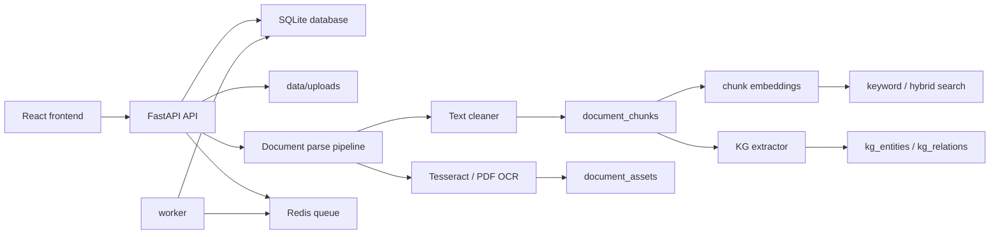

# File Processing

File Processing is a Docker-first FastAPI + React application for private file uploads, document parsing, OCR, searchable chunks, lightweight embeddings, and evidence-backed knowledge graph extraction.

The project started as a simple "upload PDF -> extracted text -> parsed" flow. It now keeps that legacy compatibility while adding the document processing foundation needed for later search and knowledge graph work.

## What You Can See In The App

- Register, log in, or use configured GitHub/Google OAuth.
- Upload task files on the task dashboard.
- Clear task history from the Tasks page.
- Upload documents from the Documents page.
- Upload PDF, TXT, Markdown, PNG, JPG, JPEG, and WEBP documents.
- See parsed document status, metadata, cleaned text, references, parse quality, and processing events.
- Search documents by keyword or hybrid score.
- Open a document detail page and inspect extracted knowledge graph entities and relations.

## Run With Docker

This project should be run through Docker for local development.

```bash
docker compose up -d --build
```

Useful URLs:

- Frontend: http://localhost:3000
- Backend API docs: http://localhost:8000/docs
- Health check: http://localhost:8000/health

Useful commands:

```bash
docker compose ps
docker compose logs -f api
docker compose logs -f frontend
docker compose logs -f worker
docker compose exec -T api python3 -m pytest
docker compose exec -T frontend npm run build
```

Docker persists local data under `./data`. Uploaded files are stored below `data/uploads`, and SQLite uses `data/app.db`.

## Architecture



The document upload path currently parses synchronously inside the API request, but it records `parse_jobs` and has service boundaries that can be moved behind the existing Redis/worker queue later.

## Phase 1 To Phase 4 Summary

### Phase 1: Document Processing MVP

Phase 1 converted the old one-column parse result into a real processing model:

- Files are persisted through `FileStorageService` into `data/uploads`.
- `documents` keeps legacy `parsed_text` compatibility and now also stores `cleaned_text`, `parse_quality_json`, and `references_text`.
- `parse_jobs` records parse attempts, status, start time, finish time, and errors.
- `document_chunks` stores chunked text with chunk type, page range, character range, token count, and parse job linkage.
- `document_assets` stores extracted or OCR assets tied back to the document and parse job.
- PDF/text cleaning now handles ligature repair, line-end hyphen repair, repeated header/footer removal, reference separation, and figure/table caption separation.
- Search can use simple keyword matching over document and chunk content.

### Phase 2: OCR

Phase 2 added OCR without introducing a new search engine:

- Image uploads are accepted as first-class documents.
- PNG, JPG, JPEG, and WEBP files are OCR'd through `OcrService`.
- Scanned PDFs fall back to page OCR when normal PDF text extraction returns no text.
- OCR output is stored in `document_assets.ocr_text`.
- OCR text is also converted into `document_chunks` so it is searchable and available to later embedding/KG steps.
- Docker installs the required OCR/PDF system packages in the application image.

### Phase 3: Embeddings And Hybrid Search

Phase 3 added the embedding foundation while keeping infrastructure small:

- `document_chunks` now has `embedding_json`, `embedding_model`, `embedding_dim`, and `embedded_at`.
- `DocumentEmbeddingService` embeds chunks after parsing.
- `HashEmbeddingProvider` gives deterministic local embeddings for MVP development and tests.
- `DocumentSearchService.hybrid_search` combines keyword signal with vector-like similarity from stored chunk embeddings.
- The API exposes `GET /documents/search?q=...&mode=keyword|hybrid`.
- The frontend Documents page exposes a search box and keyword/hybrid mode switch.

Important limitation: the app still defaults to SQLite for the local MVP. The schema is ready for embedding storage, but true pgvector support should wait until the database is moved to PostgreSQL.

### Phase 4: Knowledge Graph Foundation

Phase 4 added evidence-backed KG extraction in PostgreSQL/SQLite tables rather than jumping to Neo4j:

- `kg_entities` stores extracted entity names, labels, occurrence count, and source document.
- `kg_relations` stores subject, predicate, object, confidence, `evidence_text`, `document_id`, and `chunk_id`.
- `DocumentKgService` runs after parsing and embedding.
- Relations are grounded in chunk text, so every relation can be traced back to the source document and chunk.
- The API exposes `GET /documents/{document_id}/kg`.
- The frontend document detail page shows entity pills and a relation table with evidence.

The extractor is intentionally rule-based for the MVP. It proves the storage, API, and UI contract before introducing LLM-based extraction or a graph database.

## Project Structure

```text
.
├── app/                         FastAPI backend
│   ├── api/
│   │   ├── deps.py              Auth/database dependencies
│   │   └── routes/              HTTP routes for auth, OAuth, upload, tasks, documents
│   ├── core/                    Settings, JWT/password security, OAuth config, logging
│   ├── db/                      SQLAlchemy session and Alembic migration scaffold
│   ├── models/                  SQLAlchemy database models
│   ├── queue/                   Redis queue helpers for task processing
│   ├── schemas/                 Pydantic response/request schemas
│   ├── services/                Business logic for files, parsing, OCR, search, KG
│   ├── main.py                  FastAPI app factory and router registration
│   └── worker.py                Background worker entrypoint for queued upload tasks
├── frontend/                    Vite + React frontend
│   ├── src/
│   │   ├── auth/                Auth context and token state
│   │   ├── components/          Shared UI, uploaders, task/document cards
│   │   ├── hooks/               React Query task hooks
│   │   ├── lib/                 API client, shared types, utilities
│   │   ├── pages/               Dashboard, tasks, documents, auth pages
│   │   └── styles.css           Tailwind/global styling
│   └── package.json             Frontend scripts and dependencies
├── data/                        Local SQLite database, uploaded files, task results
├── logs/                        Runtime logs
├── Dockerfile                   Backend image with OCR/PDF dependencies
├── docker-compose.yml           API, frontend, worker, and Redis services
├── requirements.txt             Python dependencies
└── alembic.ini                  Alembic configuration
```

## Backend Modules

### API routes

- `app/api/routes/auth.py`: registration, login, current user, forgot/reset password.
- `app/api/routes/oauth.py`: GitHub/Google OAuth login callback flow.
- `app/api/routes/tasks.py`: legacy task list, task detail, result fetch, and clear history.
- `app/api/routes/upload.py`: legacy async-style file upload endpoint backed by tasks.
- `app/api/routes/documents.py`: document upload, list, search, detail, retry parse, delete, event list, and KG fetch.
- `app/api/routes/health.py`: health check.

### Services

- `app/services/file_storage.py`: writes uploaded files to durable local storage.
- `app/services/document_service.py`: creates documents, retries parsing, lists documents, soft deletes documents.
- `app/services/document_parse_pipeline.py`: orchestrates parse job creation, extraction, cleaning, chunking, assets, embeddings, and KG extraction.
- `app/services/document_parser.py`: extracts text from PDF, Markdown, and TXT sources.
- `app/services/text_cleaner.py`: repairs and segments raw text into cleaned text, captions, references, and quality metrics.
- `app/services/chunking_service.py`: builds semantic-ish chunks from cleaned document text, captions, references, or OCR output.
- `app/services/ocr_service.py`: OCR for uploaded images and scanned PDF pages.
- `app/services/document_embedding_service.py`: deterministic MVP embedding generation and chunk embedding persistence.
- `app/services/document_search_service.py`: keyword and hybrid document search.
- `app/services/document_kg_service.py`: MVP entity/relation extraction with source evidence.
- `app/services/task_service.py`: legacy task lifecycle and result handling.
- `app/services/oauth_service.py`: OAuth account linking and local user creation.
- `app/services/mail_service.py`: password reset email/logging behavior.

### Database models

- `User`: local users.
- `OAuthAccount`: linked OAuth identities.
- `Task`: legacy upload task records.
- `Chunk`: legacy chunk model kept for compatibility.
- `Document`: uploaded document metadata and parse state.
- `DocumentEvent`: document lifecycle audit events.
- `ParseJob`: parse attempt state and errors.
- `DocumentChunk`: cleaned, caption, reference, or OCR chunks.
- `DocumentAsset`: OCR and extracted asset records.
- `KgEntity`: extracted entity records.
- `KgRelation`: evidence-backed relation records.

## Frontend Pages

- `/login`, `/register`, `/forgot-password`, `/reset-password`: auth flows.
- `/oauth/callback`: stores the project JWT after provider login.
- `/`: dashboard overview.
- `/upload`: legacy task upload flow.
- `/tasks`: task table with clear-history action.
- `/tasks/:taskId`: task detail and result.
- `/documents`: document upload, document list, and document search.
- `/documents/:documentId`: document metadata, parsed output, cleaned text, references, parse quality, events, and knowledge graph.

## Main Document Flow

1. User uploads a document in the frontend.
2. `POST /documents/upload` validates the extension and stores the file in `data/uploads`.
3. `DocumentService.create_document` creates the `documents` row and initial document event.
4. `DocumentParsePipeline.run` creates a `parse_jobs` row and marks the document `processing`.
5. PDF/TXT/Markdown text is extracted. Image uploads and scanned PDFs go through OCR.
6. `TextCleaner` repairs and separates text into cleaned body text, captions, references, and quality metrics.
7. `ChunkingService` writes `document_chunks`.
8. `DocumentAsset` rows are written for OCR assets.
9. The document is marked `parsed`, and legacy `parsed_text` remains populated.
10. Chunk embeddings are generated.
11. KG entities and relations are extracted with evidence text.
12. The frontend can show search results, cleaned parse output, and KG evidence.

## API Reference

Document endpoints:

- `POST /documents/upload`
- `POST /documents/batch-upload`
- `GET /documents?skip=0&limit=20`
- `GET /documents/search?q=term&limit=20&mode=keyword`
- `GET /documents/search?q=term&limit=20&mode=hybrid`
- `GET /documents/{document_id}`
- `POST /documents/{document_id}/retry-parse`
- `DELETE /documents/{document_id}`
- `GET /documents/{document_id}/events`
- `GET /documents/{document_id}/kg`

Task endpoints:

- `POST /upload`
- `GET /tasks`
- `DELETE /tasks`
- `GET /tasks/{task_id}`
- `GET /tasks/{task_id}/result`

Auth endpoints:

- `POST /auth/register`
- `POST /auth/login`
- `GET /auth/me`
- `POST /auth/password/forgot`
- `POST /auth/password/reset`
- `GET /auth/github/login`
- `GET /auth/google/login`

## Configuration

Common environment variables:

```bash
DATABASE_URL=sqlite:///./data/app.db
REDIS_URL=redis://redis:6379/0
FRONTEND_URL=http://localhost:3000
SESSION_SECRET_KEY=change-me
JWT_SECRET_KEY=change-me
GITHUB_CLIENT_ID=
GITHUB_CLIENT_SECRET=
GOOGLE_CLIENT_ID=
GOOGLE_CLIENT_SECRET=
```

The browser-facing frontend should call `http://localhost:8000`, not the internal Docker service hostname.

For frontend overrides, create `frontend/.env.local`:

```bash
VITE_API_BASE_URL=http://localhost:8000
```

## Testing And Verification

Backend tests:

```bash
docker compose exec -T api python3 -m pytest
```

Frontend build:

```bash
docker compose exec -T frontend npm run build
```

Quick smoke check:

```bash
curl -I http://127.0.0.1:3000/documents
curl -s http://127.0.0.1:8000/health
```

Recent verification after the frontend document/KG visibility work:

- `docker compose exec -T frontend npm run build` passed.
- `docker compose exec -T api python3 -m pytest` passed with 23 tests.
- `curl -I http://127.0.0.1:3000/documents` returned `200 OK`.

## Current MVP Boundaries

- Document parsing currently runs synchronously during document upload, even though `parse_jobs` are persisted. Moving parse execution into the worker is the next infrastructure step.
- SQLite is the default local database. It is enough for the MVP, but pgvector requires PostgreSQL.
- Embeddings are deterministic hash embeddings, not production semantic model embeddings.
- Hybrid search is an MVP scoring layer over local stored embeddings and keyword matches, not OpenSearch/Qdrant.
- KG extraction is rule-based and evidence-backed. It is useful for validating data flow, but it is not yet a full LLM extraction pipeline.
- OCR quality depends on installed Tesseract language packs and input image quality.
- Alembic is scaffolded, while local SQLite compatibility is also handled in `app/db/session.py` with startup table/column checks.

## Recommended Next Steps

1. Move document parsing from synchronous API execution into the existing Redis worker.
2. Replace hash embeddings with a real embedding provider behind the existing `EmbeddingProvider` interface.
3. Migrate local production-like development from SQLite to PostgreSQL.
4. Add pgvector indexes and implement real keyword + vector hybrid ranking.
5. Improve KG extraction behind the existing `DocumentKgService` contract.
6. Add a document chunk viewer in the frontend for inspecting chunk boundaries and OCR chunks.
7. Add parse job history and asset inspection to the document detail page.
