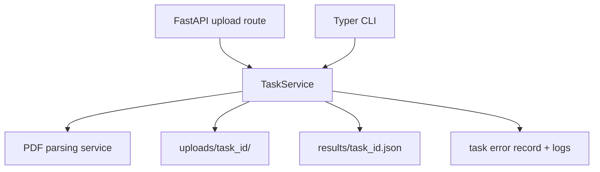
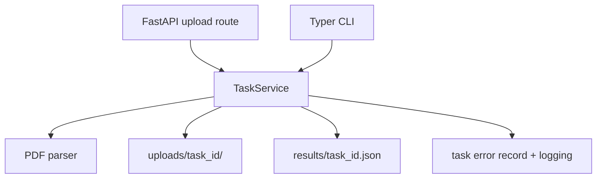

# feat: Add PDF uploads and Typer scanning

## Summary

Extend the current file-processing service into a PDF-oriented ingestion flow that stores each upload in its own task directory, writes one JSON result per PDF, and exposes the same processing rules through both FastAPI and a small Typer CLI.

---

## Problem Frame

The current app is built around flat file uploads and text-style analysis. That shape is too loose for PDF ingestion: PDFs need per-task storage, result files keyed by task ID, and a repeatable way to scan pending uploads without reprocessing what has already been handled.

---

## Requirements

- R1. FastAPI must accept PDF uploads and persist each PDF under its own `uploads/task_id/` directory.
- R2. The upload API must surface the created `task_id` directly in its response contract.
- R3. Each processed PDF must produce a `results/task_id.json` file containing `title`, `abstract`, and `body_preview`.
- R4. Typer must support processing one `task_id` and scanning `uploads` in bulk for pending PDFs.
- R5. Already-processed files must be skipped, and parse failures must be recorded for later inspection.

---

## Scope Boundaries

- Keep the existing FastAPI/task-service architecture; do not replace it with a database-backed workflow.
- Preserve the current queue-backed task model and background-worker option unless a PDF-specific adjustment is required.
- Do not expand the feature to OCR, non-PDF document types, or remote storage.
- Do not redesign unrelated health or task-list endpoints beyond what the PDF contract needs.

---

## Context & Research

### Relevant Code and Patterns

- `app/api/routes/upload.py` and `app/api/routes/tasks.py` use thin route handlers that delegate into `request.app.state.task_service`.
- `app/services/task_service.py` is the current orchestration point for upload persistence, task records, queueing, and result-file writes.
- `app/services/file_service.py` already owns upload validation and disk writes, which makes it the right place to keep generic file handling.
- `app/schemas/response.py` defines the current task/result response models and will need a PDF-oriented result shape.
- `tests/test_api.py` shows the current test style: `TestClient`, `tmp_path`, and `monkeypatch.chdir(tmp_path)` for isolated runtime state.
- `requirements.txt` already includes `click`, but not `typer`, so the CLI will need an added dependency.
- `scripts/batch_upload_test.sh` is an existing ad hoc integration helper and can serve as a reference for batch-oriented workflow expectations.

### Institutional Learnings

- No repo `docs/solutions/` tree was present, so there are no documented learnings to carry forward here.

### External References

- None used. The repo’s own FastAPI, filesystem, and test patterns are enough for this plan.

---

## Key Technical Decisions

- Keep PDF parsing behind a dedicated service boundary so the FastAPI routes and Typer commands share one ingestion path.
- Treat the per-task upload directory and `results/task_id.json` as the durable source of truth for idempotency and skip checks.
- Make the upload response expose `task_id` as a first-class field for single-file uploads, while keeping the rest of the task-centric contract intact.
- Represent parse failures as task-level errors rather than silent skips so batch scans can continue and operators can inspect what failed.
- Add Typer as a separate CLI module instead of folding command parsing into the FastAPI app entrypoint.

---

## Open Questions

### Resolved During Planning

- The same service layer should power both API uploads and CLI processing.
- Skip behavior should be keyed off existing task/result state, not off filename heuristics.

### Deferred to Implementation

- The exact PDF parsing library and extraction heuristics for `title`, `abstract`, and `body_preview`.
- Whether the bulk scan command reports only counts or also returns per-file summaries.

---

## Output Structure

    app/
      cli.py
      services/
        pdf_service.py
    tests/
      fixtures/
        pdf/
          sample.pdf
          corrupt.pdf
      test_api.py
      test_cli.py

---

## High-Level Technical Design

> This illustrates the intended approach and is directional guidance for review, not implementation specification. The implementing agent should treat it as context, not code to reproduce.

---

## Implementation Units

- U1. **PDF ingestion foundation**

**Goal:** Define the PDF-specific storage, result, and task-record boundaries that both API and CLI will rely on.

**Requirements:** R1, R3, R5

**Dependencies:** None

**Files:**
- Modify: `app/core/config.py`
- Modify: `app/schemas/response.py`
- Modify: `app/services/task_service.py`
- Create: `app/services/pdf_service.py`
- Test: `tests/test_pdf_service.py`

**Approach:**
- Keep generic upload validation and disk writing separate from PDF parsing.
- Update the task record/result model so PDF runs can store a task-scoped upload path, a task-scoped result path, and a task-level error when parsing fails.
- Make the PDF parsing path responsible for producing `title`, `abstract`, and `body_preview`, while leaving the filesystem conventions consistent across callers.

**Execution note:** Start with characterization coverage around the current upload/result contract before reshaping the PDF path.

**Patterns to follow:**
- `app/services/file_service.py`
- `app/services/task_service.py`
- `app/schemas/response.py`

**Test scenarios:**
- Happy path: a valid PDF produces a task record whose upload lives under `uploads/task_id/` and whose result points at `results/task_id.json`.
- Happy path: a parsed PDF result contains `title`, `abstract`, and `body_preview`.
- Edge case: missing or sparse metadata still yields a usable result payload with predictable fallback values.
- Error path: a corrupt or unreadable PDF records a task-level parse error instead of pretending processing succeeded.
- Integration: the task record and the result file stay aligned for the same `task_id`.

**Verification:**
- PDF-processing state is represented consistently in the task record and the result file, and failures remain inspectable.

- U2. **FastAPI PDF upload contract**

**Goal:** Make the upload route accept PDFs and return the created task ID directly.

**Requirements:** R1, R2, R3

**Dependencies:** U1

**Files:**
- Modify: `app/api/routes/upload.py`
- Modify: `app/api/routes/tasks.py`
- Test: `tests/test_api.py`

**Approach:**
- Keep the route handlers thin and let the shared service own storage and task creation.
- Surface the created `task_id` as part of the upload response so callers do not have to unpack nested summaries to discover it.
- Keep task-detail and result lookup behavior anchored on the same task ID so uploads, status checks, and result retrieval remain aligned.

**Execution note:** Write the new upload-contract tests before changing the response envelope.

**Patterns to follow:**
- `app/api/routes/upload.py`
- `app/api/routes/tasks.py`
- `tests/test_api.py`

**Test scenarios:**
- Happy path: POSTing a PDF returns the created `task_id` and a reachable task record.
- Edge case: a non-PDF upload is rejected before a task is created.
- Edge case: an oversized PDF is rejected before persistence.
- Integration: the returned task ID can be used to fetch task detail and, after processing, the PDF result.

**Verification:**
- The API exposes task IDs directly for PDF uploads and still behaves like a task-oriented service.

- U3. **Typer CLI processing**

**Goal:** Add a CLI that can process one `task_id` or batch-scan uploads for pending PDFs.

**Requirements:** R4, R5

**Dependencies:** U1

**Files:**
- Create: `app/cli.py`
- Modify: `requirements.txt`
- Test: `tests/test_cli.py`

**Approach:**
- Put CLI orchestration in its own module and call into the same service layer as FastAPI.
- Support a single-task command for direct recovery/debugging and a scan command that walks the uploads tree for tasks that have not yet produced results.
- Skip work when the matching result already exists so repeated scans stay idempotent.

**Patterns to follow:**
- `app/services/task_service.py`
- `scripts/batch_upload_test.sh`

**Test scenarios:**
- Happy path: one explicit `task_id` is processed and writes the expected result file.
- Happy path: a batch scan processes only pending PDFs and leaves already-processed tasks untouched.
- Edge case: an already-processed task is skipped without rewriting its result file.
- Error path: a parse failure is reported for the specific task and does not stop the rest of the batch.
- Integration: CLI processing and API retrieval observe the same task/result state.

**Verification:**
- The CLI can operate on a single task or the whole upload tree without duplicating the API logic.

- U4. **Tests and documentation**

**Goal:** Lock the new contract in tests and update the project docs so the PDF flow is discoverable.

**Requirements:** R1, R2, R3, R4, R5

**Dependencies:** U2, U3

**Files:**
- Modify: `README.md`
- Test: `tests/test_api.py`
- Test: `tests/test_cli.py`
- Test: `tests/test_pdf_service.py`
- Create: `tests/fixtures/pdf/sample.pdf`
- Create: `tests/fixtures/pdf/corrupt.pdf`

**Approach:**
- Extend the existing API test style to cover the new task ID contract and PDF result shape.
- Add CLI coverage that exercises both single-task processing and bulk scanning.
- Update the README to match the new PDF workflow, result layout, and CLI entrypoint.

**Patterns to follow:**
- `tests/test_api.py`
- `README.md`

**Test scenarios:**
- Happy path: the documented upload and CLI flows match the exercised API/CLI behavior.
- Edge case: a corrupt PDF fixture fails with a recorded error instead of a false success.
- Integration: the README examples line up with the actual result and skip semantics.

**Verification:**
- The documented workflow and the test suite both describe the same PDF pipeline.

---

## System-Wide Impact

- **Interaction graph:** FastAPI upload routes and the Typer CLI both feed the same task-service path, which then writes task-scoped files and records parse errors.

- **Error propagation:** Parse failures should be captured on the task record and in logs so CLI scans can continue and API callers can inspect the failure later.
- **State lifecycle risks:** Partial result writes and duplicate processing are the main hazards; the plan relies on task-scoped paths and skip-on-existing-result behavior to keep the flow idempotent.
- **API surface parity:** Single-upload API behavior and single-task CLI behavior should share the same task/result contract.
- **Integration coverage:** The important cross-layer checks are upload -> task ID -> result retrieval and CLI scan -> skip existing result -> failure reporting.
- **Unchanged invariants:** Health checks, the queue-oriented task model, and the optional background worker stay in place.

---

## Risks & Dependencies

| Risk | Mitigation |
|------|------------|
| PDF extraction quality may vary widely by document. | Keep parsing behind a dedicated service so heuristics can evolve without rewriting API or CLI orchestration. |
| Repeated scans could reprocess files or corrupt state if skip detection is loose. | Use task-scoped result presence and task status as the idempotency gate. |
| The upload response shape change may affect callers. | Lock the new contract in tests and document the direct `task_id` behavior in the README. |

---

## Documentation / Operational Notes

- Update `README.md` to describe the PDF upload path, the CLI entrypoint, and the new JSON result shape.
- Add the Typer dependency to `requirements.txt`.
- Keep the test fixtures small and local so the PDF workflow remains easy to run in isolation.

---

## Sources & References

- Related code: `app/main.py`
- Related code: `app/api/routes/upload.py`
- Related code: `app/api/routes/tasks.py`
- Related code: `app/services/file_service.py`
- Related code: `app/services/task_service.py`
- Related code: `app/schemas/response.py`
- Related code: `tests/test_api.py`
- Related code: `requirements.txt`
- Related code: `README.md`
